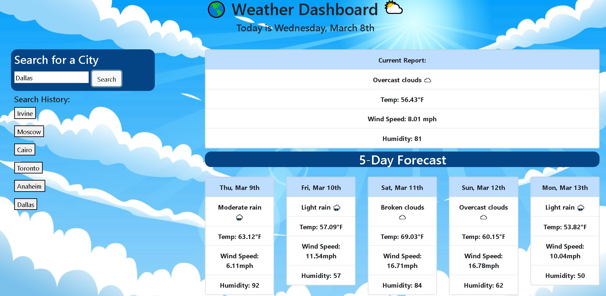

# Weather Dashboard

## Description

Weather forecasts allow people to plan out their day and prepare for the week ahead of them. This application allows the user to quickly and easily look up the current and future weather conditions of any city around the world. It retreives up-to-date and accurate data from a server-side api and translates it to an easily navigable webpage. If you are going on a trip to multiple locations, use this weather dashboard to help plan accordingly for weather events or to figure out what kind of clothing you might need to pack.

## User Story

```
AS A traveler
I WANT to see the weather outlook for multiple cities
SO THAT I can plan a trip accordingly
```
## Installation

N/A

## Example of App

The following image shows the web application's appearance and functionality:



## Links 

Deployed Application - https://david8127.github.io/WeatherApp/

My Github - https://github.com/David8127